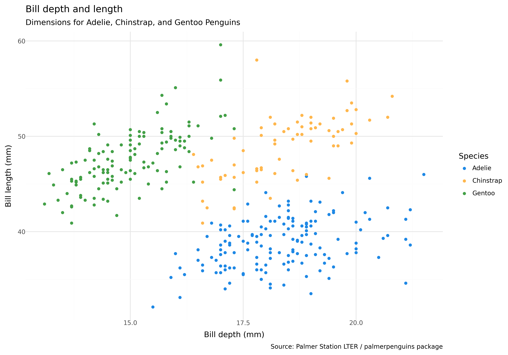

<p class="intro"><span class="dropcap">T</span>his post takes a dive into simple, yet powerful data visualization tools. We will explore using ggplot in R and how to use similar visualization tools using Python packages to accomplish the same thing.</p>

## Introduction  

There are many many packages to help make data visualization more powerful and accessible to all skill levels. These packages and methods may seem overwhelming at firt. Today, we are going to take a look at some of the most commonly used data visualization tools, walk through how to use each one and compare the results from using different pacakges to help you decide which package will be best for you on your next project!

We are going to be using the *Palmer Penguins* data set. This data set is commonly used and is great to show various possible variations without getting too complicated or having to wory about tidying data(We will save that for another post). To import the dataset:


from palmerpenguins import load_penguins

penguins = load_penguins()
penguins.head()


Let's take a look at the first few rows of this dataset so we get an idea of the format and variables

penguins.head()



## Scatter Plot

Looking at the data we have may different variables. To start out with some exploratory data analysis it can be helpful to compare several variables at once. A scatter plot is a great way to compare more than two variables using colors, shapes or sizes. Let's start by comparing bill length, bill depth, and species.

Let's first do this using the plotnine package. The plotnine package uses the same framework as ggplot2(the renouned R visualization framework)


from plotnine import *
plot = (ggplot(penguins,
               aes(x='bill_depth_mm',
                   y='bill_length_mm',
                   color='species'))
        + geom_point()
        + labs(
            title="Bill depth and length",
            subtitle="Dimensions for Adelie, Chinstrap, and Gentoo Penguins",
            x="Bill depth (mm)", y="Bill length (mm)",
            color="Species",
            caption="Source: Palmer Station LTER / palmerpenguins package"
        )
        + scale_color_manual(values=['#2E86C1', '#28B463', '#E74C3C'])  # Custom color scheme
        + theme_minimal())

print(plot)



---
---

### Links 

To create a link (internal or external), enclose the link text in brackets (e.g., [Statistics Department]) and then follow it immediately with the URL in parentheses (e.g., (https://statistics.byu.edu)).

For example:
```
My favorite department at BYU is the [Statistics Department](https://statistics.byu.edu).
```
My favorite department at BYU is the [Statistics Department](https://statistics.byu.edu)


If you want external links to open in a separate window, you will need to use html code with `target="_blank"` inside the `a` tag. 

For example:
```
My favorite department at BYU is the <a href="https:statistics.byu.edu" target="_blank">Statistics Department</a>
```
My favorite department at BYU is the <a href="https:statistics.byu.edu" target="_blank">Statistics Department</a>


----
----

### Internal Links and Files

If you want to have a link that points to another location on your site or if you want to include a file (such as an image or video) you must use the `site.url` and `site.baseurl` variables when making the link reference.  For example, this link to pointing to the [About]({{site.url}}/{{site.baseurl}}/about) page is coded as:
```
[About]({{site.url}}/{{site.baseurl}}/about)
```
Paths to files should also be referenced with the `site.url` and `site.baseurl` variables (see the section on **Adding Images**).

---
---

### Adding Images
*In the examples below, if your image ends with `.png` or `.JPEG`, use the appropriate extension instead of `.jpg`.*  

Images for the blog will generally but put into the `assets/img` folder.  (You can also create a subfolder for images, but you will need to include the subfolder name in the reference link.) 

Markdown syntax for including images is ``.  For example:
```

```


---
---

### Resizing images

The image I added in the previous section seems a bit large for this post.  Unfortunately,
there isn't a good way to resize images with markdown, so if you need to resize an image, use html instead of markdown and specify the width in the style parameter as follows:

```

```

(Example with width set to 300 pixels)


(Example with width set to 100 pixels)


---

### Troubleshooting

Here are some things to keep in mind if your blog appearance isn't going as you planned:

**Problem:  The blog post that I created isn't appearing**

Possible Solutions: 
  - Check your date. GitHub pages won't display blog posts with future dates
  - Check the name of the post file.  It must be in the form "YYYY-MM-DD-title.md".  Make sure that you included the `.md` extension 
  - Check the yaml header.  If there are any special characters in any of the fields, you need to use quotes around the entire field entry.  The most common culprit is the description.  If you're having trouble, try putting quotes around the entire description

---

**Problem:  I know that I made changes to a blog post but the changes aren't appearing**

Possible Solution:
  - Check the header.  If there are any special characters in any of the fields, you need to use quotes around the entire field entry.  The most common culprit is the description.  If you're having trouble, try putting quotes around the entire description.

---

**Problem:  My entire blog has weird formatting**

Possible Solution:
  - Usually this is an address problem.  Double check your url and baseurl in the `_config` file
